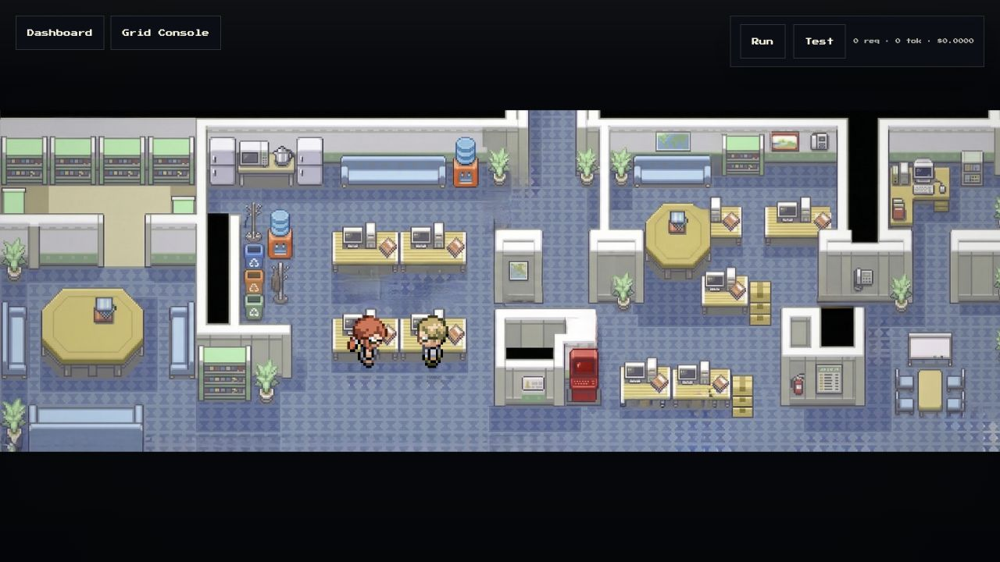
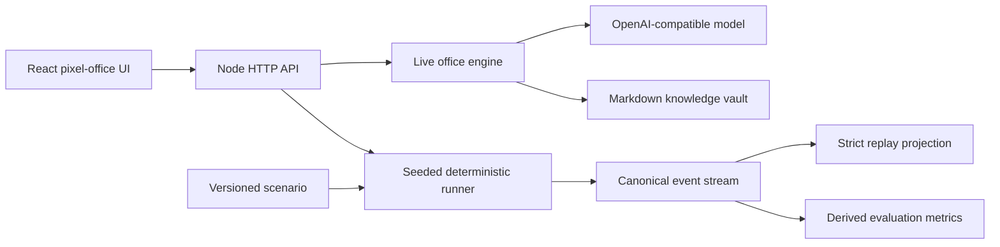

# No Man's AI

[](https://github.com/theos2node/no-mans-ai/actions/workflows/ci.yml)
[](LICENSE)
[](package.json)
[](tsconfig.json)

An observable laboratory for LLM-directed office simulations. No Man's AI combines a pixel-office operator surface, a live model-backed planner, an Obsidian-style knowledge vault, and a deterministic experiment runner for repeatable research.



## Why this exists

Agent demos often hide the useful parts: what the agents decided, why they waited, which request unlocked an action, and whether a run can be reproduced. No Man's AI makes those mechanics inspectable.

- Watch workers move, plan, request approval, send email, and archive outcomes.
- Use an OpenAI-compatible endpoint or local Ollama deployment for live planning.
- Persist shared knowledge and per-agent memory as readable Markdown.
- Run seeded, fixture-driven experiments without model calls or vault writes.
- Replay strict canonical event streams and derive results from the log.

## Two execution modes

| Mode | Planner | Persistence | Best for |
| --- | --- | --- | --- |
| Live office | Local or OpenAI-compatible model | Markdown vault and runtime state | Observing emergent workflows |
| Deterministic experiment | Versioned scenario + seeded runtime | In-memory canonical events | Tests, evaluation, and regression analysis |

The deterministic path is intentionally isolated from the live planner. It never calls a model and never mutates `the archives/No man's AI` or `data/office-runtime.json`.

## Quick start

Requires Node.js 22.18 or newer.

```bash
git clone https://github.com/theos2node/no-mans-ai.git
cd no-mans-ai
npm install
cp .env.example .env
```

Start the API and UI in separate terminals:

```bash
npm run api
npm run dev
```

Open [http://localhost:5173](http://localhost:5173). The API listens on port `8787` by default, and Vite proxies `/api` and `/events` to it.

The copied environment keeps live model and vault access disabled. After reviewing the synthetic vault and planner configuration, set `ENABLE_LIVE_MODE=true` in `.env` to enable the live dashboard routes. Deterministic scenario and replay routes remain available either way.

## Live planner configuration

`.env.example` is configured for a local OpenAI-compatible endpoint. The important settings are:

| Variable | Purpose |
| --- | --- |
| `OPENAI_API_KEY` | Credential or local placeholder such as `ollama` |
| `OPENAI_BASE_URL` | OpenAI-compatible `/v1` endpoint |
| `OPENAI_MODEL` | Model used by live workers |
| `PLANNER_REQUEST_TIMEOUT_MS` | Planner request timeout |
| `PLANNER_MIN_REQUEST_GAP_MS` | Minimum delay between serialized requests |
| `PLANNER_RETRY_BACKOFF_MS` | Cooldown after planner failures |
| `OPENAI_INPUT_COST_PER_1M` | Optional dashboard cost estimate |
| `OPENAI_OUTPUT_COST_PER_1M` | Optional dashboard cost estimate |
| `ENABLE_LIVE_MODE` | Explicitly enables model- and vault-backed routes; defaults to `false` |
| `HOST` | API bind host; defaults to `127.0.0.1` |

The planner queue is serialized, throttled, retried with backoff, and cooled by a circuit breaker so a local model is not hit concurrently or in a tight failure loop.

The optional `npm run proxy` helper expects `LOCAL_OPENAI_PROXY_APP` and `LOCAL_OPENAI_PROXY_ENV`. Its virtual environment defaults to `.proxy-venv` and can be overridden with `LOCAL_OPENAI_PROXY_VENV`.

## Deterministic experiments

Run the included refund-approval scenario:

```bash
npm run scenario -- refund-approval
npm run scenario -- refund-approval --json
```

The same scenario, seed, and run ID produce byte-identical canonical JSON. The fixture covers inbox review, archive lookup, manager approval, drafting, sending, and archival.

Every schema-v1 event has the envelope:

```text
{ schemaVersion, runId, scenarioId, scenarioVersion,
  sequence, tick, type, actorId, payload }
```

Replay enforces sequential sequence numbers, nondecreasing logical ticks, run and scenario identity, lifecycle rules, actor/action validity, exact payload shapes, and causal inbox/request references. In-progress streams can also be replayed.

### Experiment API

```text
POST /api/runs                 create and start a run
GET  /api/runs/:runId          read state, events, and metrics
POST /api/runs/:runId/step     execute one fixture step
POST /api/runs/:runId/finish   finish the current run
GET  /api/runs/:runId/events   read canonical events
POST /api/replay               rebuild public state from scenario + events
```

`POST /api/runs` accepts:

```json
{
  "scenarioId": "refund-approval",
  "runId": "optional-run-id",
  "seed": 424242
}
```

JSON bodies are limited to 256 KiB. Run IDs are validated, duplicates return `409`, and only the newest 100 deterministic runs are retained in memory.

## Architecture



The live and deterministic paths share the office vocabulary while keeping inference and persistence out of repeatable evaluation runs.

## Repository map

```text
src/App.tsx                    operator dashboard and pixel office
src/api/simulationEngine.ts    live planner and office workflow engine
src/api/obsidianVault.ts       Markdown-backed memory and knowledge storage
src/simulation/                deterministic runner, events, replay, metrics
scenarios/                     versioned experiment fixtures
scripts/run-scenario.ts        deterministic CLI
tests/simulation.test.ts       replay, lifecycle, causality, and HTTP tests
the archives/No man's AI/      bundled synthetic demo vault
```

The bundled archive is synthetic demonstration data. Do not replace it with personal, customer, or production content.

## Development

```bash
npm run check
npm test
npm run build
npm run ci
npm audit
```

To rebuild walking sprites, provide a directory containing the expected named source strips:

```bash
npm run build:sprites -- ./path/to/source-strips
```

## Security and project status

This is an experimental local application, not a hardened multi-user service. The API binds to `127.0.0.1` by default, and model- or vault-backed routes return `503` unless `ENABLE_LIVE_MODE=true` is set explicitly. The HTTP API has no authentication, so do not change the bind host or run live mode around sensitive data without adding access controls and reviewing the persistence model.

Deterministic scenarios currently use a compact declarative action vocabulary. They do not emulate model-generated plans, token use, or full vault contents.

See [CONTRIBUTING.md](CONTRIBUTING.md) for contribution expectations and [SECURITY.md](SECURITY.md) for private vulnerability reporting guidance.

Released under the [MIT License](LICENSE).
